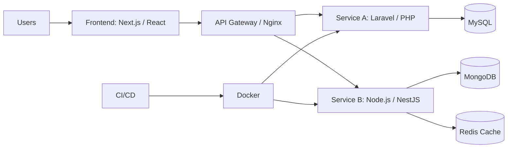

  
  
  

## 👨‍💻 About

I am a **Software Engineer** and **Full Stack Developer** with a B.Sc. in Software Engineering from **Kabul University**. I specialize in building scalable web applications, combining modern frontend interfaces with robust backend architectures.

My expertise spans the **JavaScript ecosystem** (Next.js, React, Node.js) and the **PHP ecosystem** (Laravel). I focus on writing clean, maintainable code and implementing secure, high-performance systems.

### What I do
- Frontend: Building responsive, accessible UIs using React, Next.js, and Tailwind CSS.
- Backend: Developing RESTful APIs and microservices using Node.js/NestJS and PHP/Laravel.
- Database: Designing efficient schemas with MySQL, PostgreSQL, and MongoDB.
- DevOps: Managing deployment pipelines, Docker containers, and cloud environments.

 

---

## 🧭 Competency Pillars

<table> <tr> <td align="center" width="33%">   <b>Modern Frontend</b>  React, Next.js, Tailwind </td> <td align="center" width="33%">   <b>Robust Backend</b>  Node.js, Laravel, PHP </td> <td align="center" width="33%">   <b>Data Engineering</b>  MySQL, MongoDB, SQL </td> </tr> </table>

---

## 🛠️ Tech Stack

### 💻 Languages
    

### 🎨 Frontend
    

### ⚙️ Backend & Frameworks
   

### 💾 Databases & Tools
    

---

## 🧱 Architecture & Engineering Practices

I optimize for reliability and maintainability by applying proven principles and patterns:
- Clean Architecture: Explicit boundaries and testable business rules.
- SOLID Principles: Creating scalable and cohesive code units.
- System Design: Efficient database modeling and API structure.

### Reference architecture

---

## 📊 GitHub Statistics

   

  

---

## 📫 Contact

  

    

<b>Building scalable systems with clean interfaces, robust backends, and measurable outcomes.</b>

